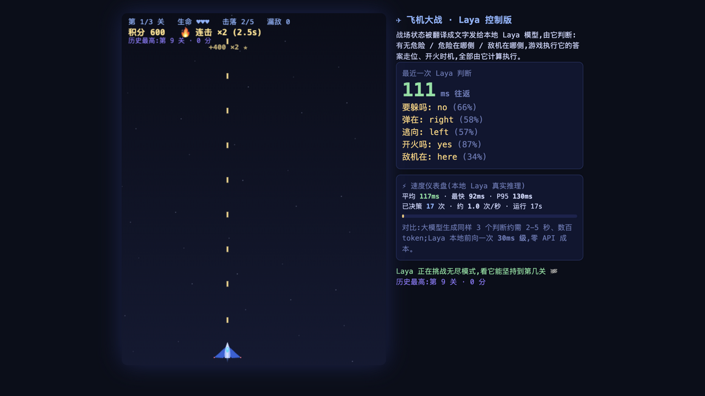

# 飞机大战 · Laya 控制版 🛩️🤖

一个 H5 飞机大战,但**驾驶它的是一个本地 AI 决策模型**——[Laya](https://github.com/NandhaKishorM/laya)(System 1 分类器,Apache 2.0)。游戏把战场状态翻译成文字发给本地模型,由它实时判断"要不要躲、子弹在哪侧、走哪条走廊、敌机在哪、是否开火",游戏执行它的答案。



这不是"AI 辅助":从走位、躲弹到开火时机,**每一个操作决策都由 Laya 计算**。核心看点是速度——每次决策往返约 80–150ms,每秒 5–6 次完整决策循环,全部发生在你自己的电脑上,零 API 成本。

## 运行

```bash
./start.command        # macOS 双击即可
```

- 已缓存模型 → 完全离线,约 10 秒进游戏;
- 新机器首次运行 → 自动创建虚拟环境、安装 `laya`、下载约 750MB 模型权重(国内走 hf-mirror);
- 服务已在运行 → 直接打开页面,不重复启动。

要求:macOS + Python 3.10+(Apple Silicon 可选 MPS 加速)。浏览器访问 `http://127.0.0.1:8787`。

## 玩法

- **无尽模式**:每关难度严格递增(敌机速度、弹速、弹幕密度、蛇形漂移、配额全部无封顶);
- **奖励系统**:击落得分(满血双倍 ★)、3 秒内连击倍率最高 ×5、连击满格触发 8 秒火力增强(射速翻倍 + 三发扇形弹);
- **零容忍**:被击中 / 漏敌会打断连击,漏敌计数在 HUD 变红;
- **纪录**:生命耗尽后从第 1 关重开,历史最远关卡和最高分永久记录(localStorage);
- 右侧面板实时显示 Laya 的每次判断(带置信度)和速度仪表盘(平均/最快/P95、决策频率)。

## 它是怎么玩的:Laya 的决策回路

游戏每 150ms 把战场状态(玩家位置、每颗逼近子弹的方位与到线时间、左右走廊畅通度、最紧急敌机方位)翻译成英文描述,发给本地 Laya 模型,拿回五个结构化判断:

| 判断 | 类型 | 驱动 |
|---|---|---|
| `dodge` — 有子弹要撞上吗? | choice yes/no | 是否触发闪避 |
| `bullet_side` — 迫近弹在哪侧? | choice left/right | 逃离方向 |
| `dodge_dir` — 哪条走廊更空? | choice left/right | 弹道正对头顶时裁决 |
| `fire` — 敌机对准了吗? | choice yes/no | 开火时机 |
| `enemy_side` — 最紧急敌机在哪? | choice left/right/here | 拦截走位 |

**分工原则:空间方位判断交给模型,时间/几何计算交给反射层。** 这是实测换来的——数字阈值推理它只有 ~39% 准确率,而空间方位判断接近 100%。闪避方向永不横穿活弹道、方位与弹道事实矛盾时以事实为准,这两条保险丝保证"必须躲开子弹"不破功。

## 无头模拟器

`game_core.py` 与网页版逻辑同构,可以不开浏览器批量验证策略与难度:

```bash
python sim.py 5 4    # 第 5 关跑 4 局,输出通关率 / 漏敌 / 中弹 / 用时
```

调参历史中的实测数据:L1 4/4、L5 4/4(零漏敌)、L8 2/2;难度墙在第 8–10 关之间。

## 文件

| 文件 | 作用 |
|---|---|
| `start.command` | 一键启动(环境自举 + 决策服务 + 打开浏览器,带守护重启) |
| `server.py` | 决策服务:GET / 游戏页面,POST /decide 调 Laya Router(串行锁,MPS 加速) |
| `index.html` | 游戏本体(canvas 渲染、物理、奖励系统、Web Worker 主循环、决策回路) |
| `game_core.py` / `sim.py` | 无头模拟器(策略回归测试) |
| `screenshot.png` | 游戏截图 |

## License

MIT(游戏代码)。Laya 模型遵循其自有 Apache 2.0 许可。
